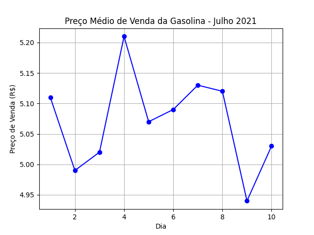

# gasoline-table

# Análise de Preços da Gasolina

Este projeto realiza a análise dos preços médios de venda da gasolina na cidade de São Paulo nos 10 primeiros dias de Julho de 2021. O objetivo é visualizar a variação desses preços ao longo do período especificado.

## Conteúdo

1. [Dados](#dados)
2. [Gráfico de Linha](#gráfico-de-linha)
3. [Como Executar](#como-executar)

## Dados

O arquivo `gasolina.csv` contém os dados de preço da gasolina. A tabela possui duas colunas: `dia` e `venda`.

## Gráfico de Linha

O script `main.py` utiliza a biblioteca Matplotlib para gerar um gráfico de linha representando a variação dos preços ao longo dos dias.



## Como Executar

Certifique-se de ter Python e as bibliotecas necessárias instaladas. Você pode executar o script da seguinte maneira:

```bash
python main.py
```
